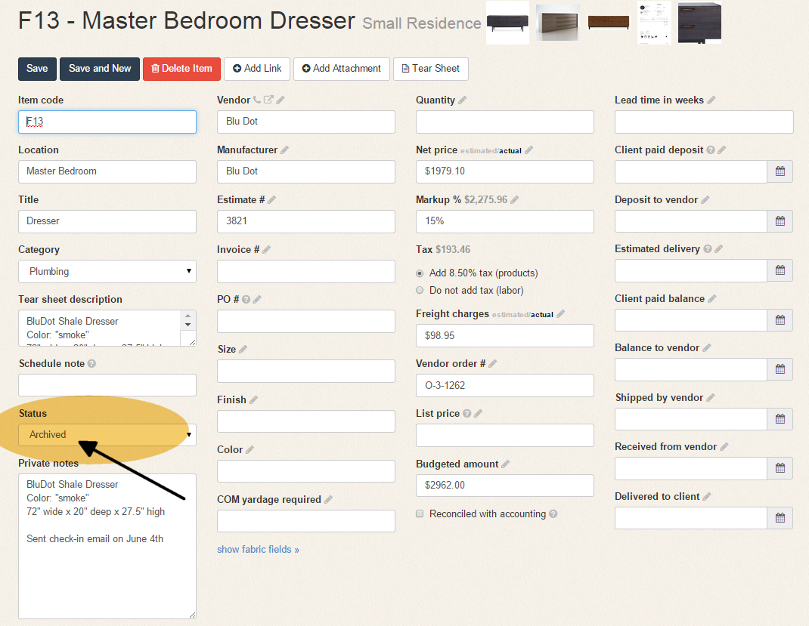
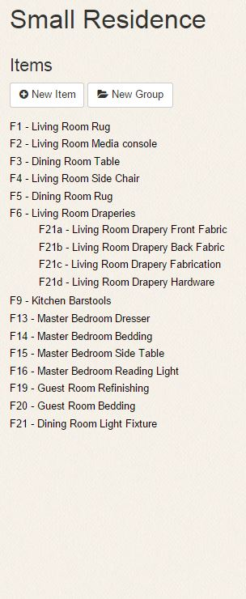
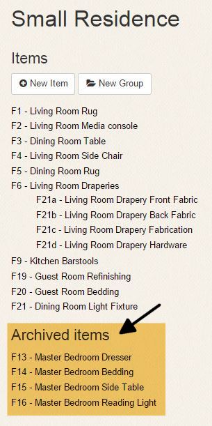

Title: Archiving
Order: 500
Hidden: true

# Archiving

Archiving is the best way to keep completed items from cluttering your workspace. To archive an item, simply change its status to "Archived."

Once an item has been archived, it will appear on a separate list of archived items on the project page. If none of the items in your project have been archived, you won't see an archived list at all.

Here's what this project looks like without any archived items: 

And here's how it looks once we've archived the items in the master bedroom:

The following applies to archived items:

1. They won't appear on the list as you navigate through active items using your arrows.
2. They won't appear in any reports unless you check the "Show archived items" box in the Project Report.

