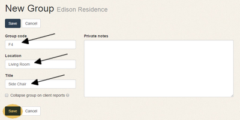

Title: Groups
Order: 500

# Groups #

Think of groups as folders for items that go together, for example a sofa and its fabric, or a set of draperies which might include hardware, fabric, fabrication, and installation.

When going over a project with your client, you could show them individual line items for each component that goes into the draperies:

Or you may prefer to have a single line item on the budget: 

	 

Either way, you're going to want to track the details for each component independently. Creating a group gives you that flexibility.

To create a Group:

1) From the project page, click the New Group button. 

2) On the New Group screen, enter the information you'd like for the Group Code, Title, Location and Notes Fields, then click Save. 

3) Your new group will appear in the list of items on the project page. If you have existing items you'd like to include in the group, you can drag them here to move them into your new group. 

4) To create new items for your group, click the group, then click the Add New Item to Group button. 

5) You'll be taken to a New Item page where you can enter your new item data as usual.

### Collapsing groups on client reports ###

On the Group page, you'll notice a "Collapse group on client reports" checkbox: 

When this box is checked the entire group will appear as a single line item on cient reports. For example, you may have a Dining Chairs group which contains separate items for the chair frames and the leather that will be applied to them. When this box is checked, these will be combined into one line when you run a report with the Client View option selected.

### Existing "old style" groups ###

If you are one of our beta users and have existing projects with "Items" and "Sub-Items", we've left them just as they were. You can see, edit, and report on them as usual, but you won't be able to add new items. If you'd like to convert these items to groups, just create a new group and drag your existing items into it. If you need help or have any questions, contact us at [feedback@designthology.com](mailto:feedback@designthology.com).

