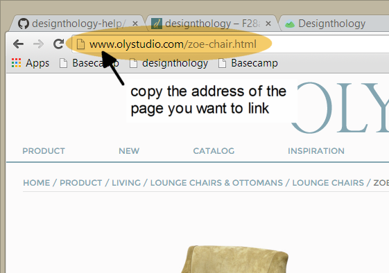
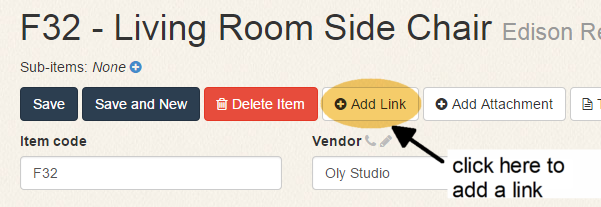
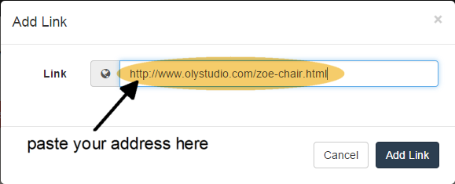
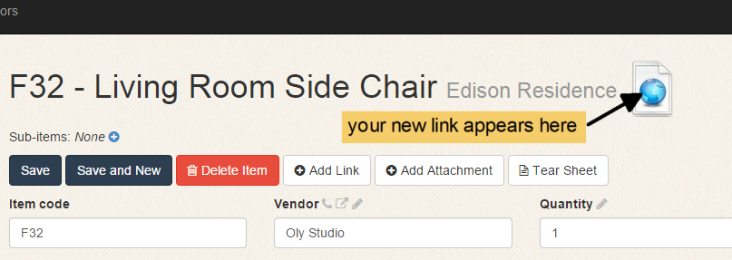

Title: Links and Attachments
Order: 200

# Links and Attachments

You can add links and attachments to your Designthology items. This is great because:  
- you use linked or uploaded images to create your own tear custom tear sheets (see Add your own Logo)  
- saved links can take you directly to a vendors webpage about the item.   
- saved attachments like vendor invoices and scans of your CFAs mean no more keeping paper in binders!

## Attach Links to an Item

1. Open a browser tab and navigate to the web page you'd like to link to your item.  

2. Copy the address from the address bar.   

3. Navigate to your designthology.com item page.

4. Make sure your item is saved, then click the **Add Link** button toward the top of the screen.  
  
 
5. In the "Add Link" window, paste the web address, and click **Add Link.**  
  

6. A new icon will appear at the top of the page - click it at any time to return to the linked page.

    The type of link icon created depends on the kind of link: links to web pages will appear as a browser icon, links to pdf pages will display a thumbnail of the pdf, and links to images (.jpg, .png, .gif files) will appear as a thumbnail of the image.

## Attach Files to an Item
1. Make sure your item is saved, then click the **Add Attachment** button toward the top of the screen.

2. In the "Add Attachment" window, click the **Choose File** button, navigate to the file you'd like to upload, and click **Save.**

3. A new icon will appear at the top of the page - click it at any time to view the attached file.

    The type of link icon created depends on the kind of file you upload: .pdf files will display a thumbnail of the pdf, image files (.jpg, .png, .gif files) will appear as a thumbnail of the image. Unrecognized files types will display as a browser icon. When you click on an attachment with an unrecognized file type, a copy of the file will be downloaded to your hard drive.

## Delete a Link or Attachment
To delete a link or an attachment, hover your mouse over the desired icon, and click the **x** that appears in the upper right hand corner. Click the red **Delete Link** icon in the confirmation window.

